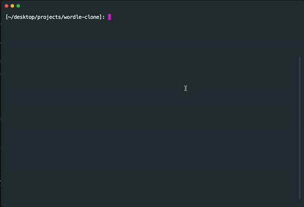

# wordle-clone
Refreshing my memory on C++ by building a terminal Wordle clone



Use the commands below to play:

Clone repo
```
git clone https://github.com/punnkam/wordle-clone.git;
cd wordle-clone
```

Compile and run
```
g++ -o main main.cpp; 
./main
```
